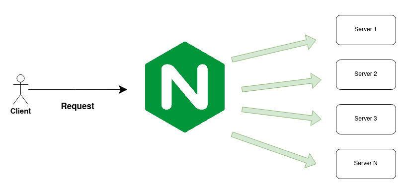

# Description

Express JS with load balancing using Nginx

Express js running on port 3000
Nginx running on port 80

Untuk port bisa diubah sesuai kebutuhan dan konfigurasi
Di dalam code express js terdapat os.hostname untuk mengecek bahwa express berjalan didalam container yang berbeda.
Express js dibuat dalam beberapa container menggunaka replica docker-compose, kebutuhan container backend dapat disesuaikan.


Gambaran load balancer diatas

# Git clone

clone this repository

# docker build

```bash
sudo docker-compose build
```

# docker up

```bash
sudo docker-compose up
```

or running in background

```bash
sudo docker-compose up -d
```
